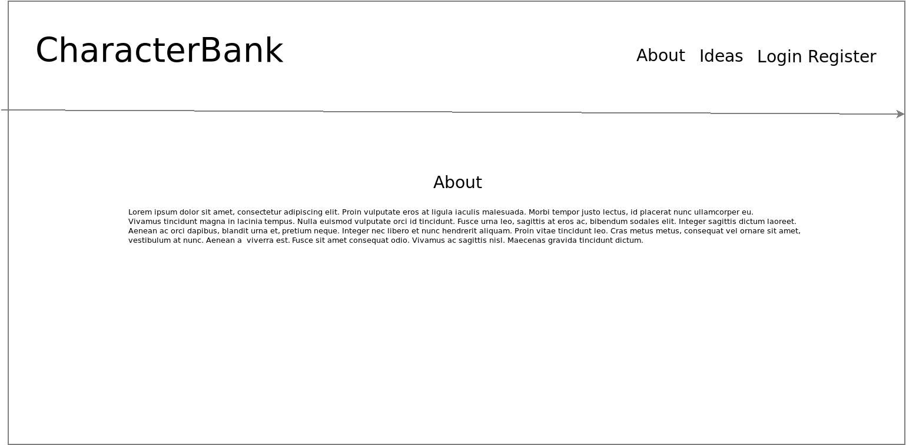
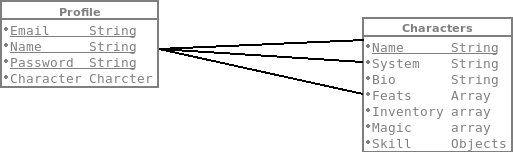
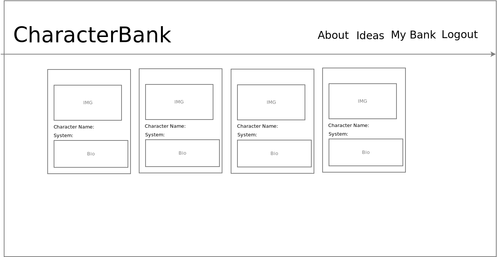
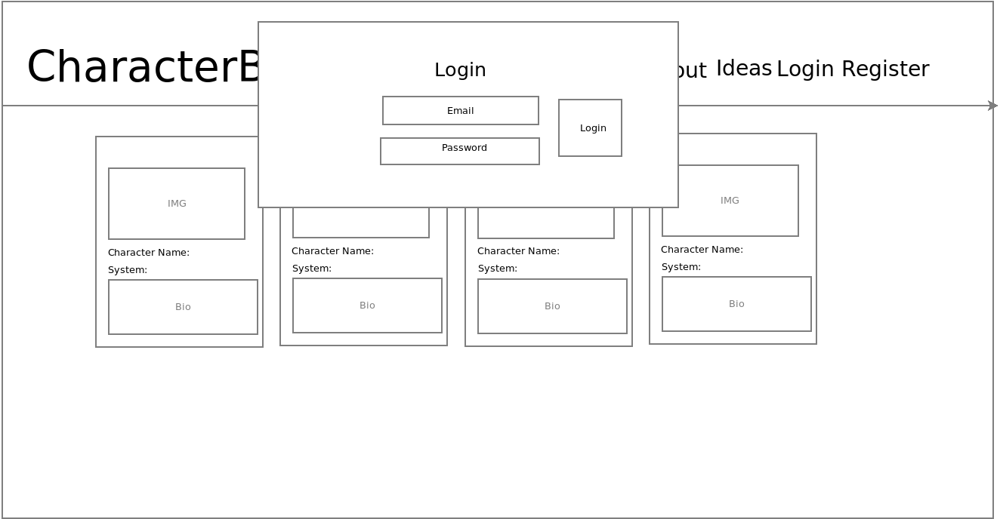
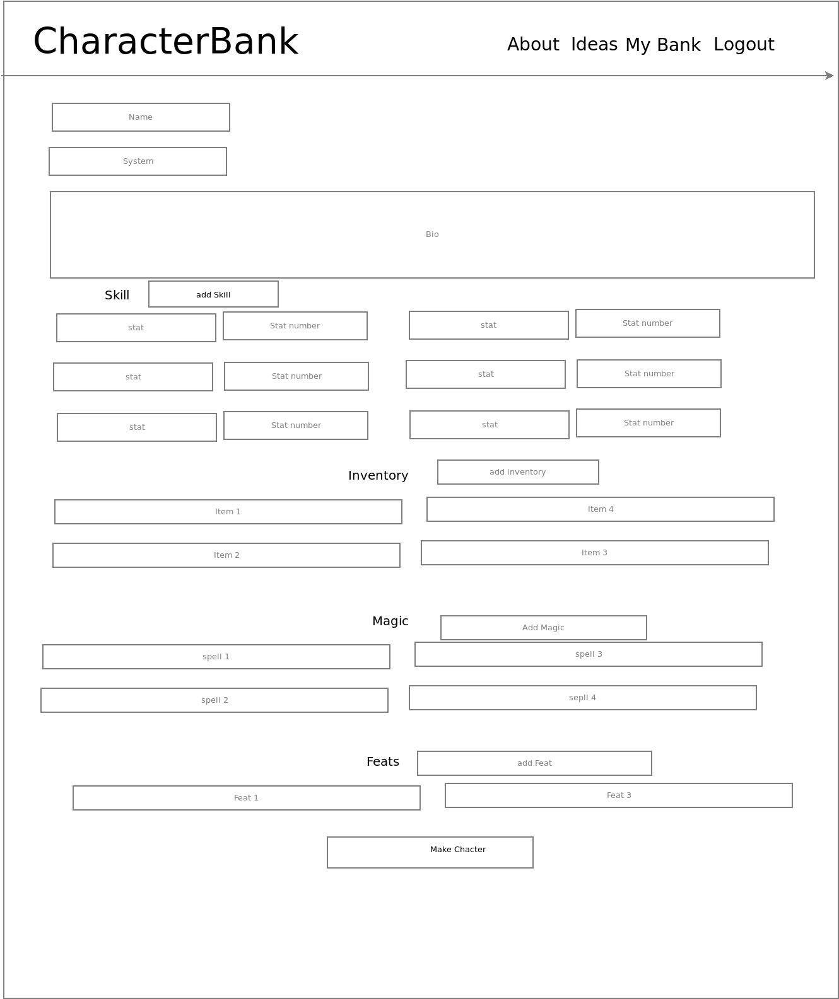
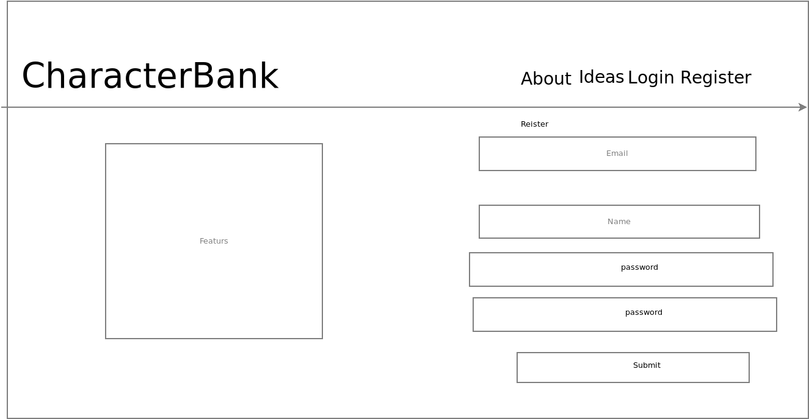

## Project 4 Character Bank Client

By Alvin Wong

## Scope

This Client is built in React and provides the user interaction. Providing user to make and store characters.

## Tool Used
    -React
    -Bootstrap

## User Stories

I. The User will see the home page of website see 'Welcome to Character Bank'

II. The nav will have 'all character', 'about' , 'Register' , and 'login'

III. When User click All Character the user will see all the character stored on this site

IV. When the user clicks on a charcter the user will see the character in more detail 

v.When user clicks about they will see a about page and about the website

VI. When user clicks Register they will be brought to the resgister page 

VII. Whent the user register they will be brought to a blank page with logo and nav will have changed

VIII. The user will see a logout and profile nav

IX. When the user clicks profile they see their name and  create character and their charcter they have made which should be blank from the start.

X. When the user clicks create a character they will see inputs to put data into 

XI. When user clicks edit charcater they see the same sorta input from create and they can edit the data as they which

XII.When user clicks delete they will delete the character.

## Wireframes

